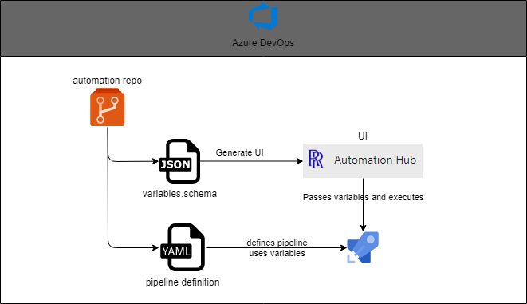

# Problem Statement

### Specific 

1. Wider uptake of ADO requires a level of standardisation, simplification and governance 
   - Examples: Creating repositories in a standard way, creating projects/teams, manageing security groups
1. Wider automation of Azure resources could/should be carried out via Infrastructure-as-Code (IaC) executed using pipelines. These pipelines can be tricky to run and hard to access 

### General

1. Running of ADO pipelines can be clunky when setting multiple, complex variables 
1. Common pipelines for general consumption across ADO is difficult (hard to find and execute for beginners)

# Solution 

Create an extension in DevOps that incurs minimal overhead and leverages current pipeline/git features. 

Overview:

- A `JSON` Schema is stored alongside the `YAML` pipeline file
- The schema represents the variables required by the pipeline
- An extensions to DevOps, reads this schema and auto-generates a User Interface for the user enter variables 
- On submit, the extension validates the variables and runs the associated pipeline, passing the variables set 
- A user can monitor the progress using the usual pipeline run UI

## Architecture

## Software Assurance 

Elements of this solution that involved Rolls-Royce developed software have been developed in line with the [Software Assurance Process](https://rollsroyce.sharepoint.com/sites/engineroom/en-gb/engineering/pages/software-engineering.aspx). 

## Software Risk Assessment

The questions below derive from the [Rolls-Royce Software Risk Assessment](https://rollsroyce.sharepoint.com/:b:/r/sites/engineroom/en-gb/engineering/Documents/Software%20Engineering/Rolls-Royce%20Software%20Risk%20Assessment.pdf?csf=1&web=1&e=p1fYeg)

- Does your software have a direct safety impact: No
- Does your software have a business-critical impact: No
- Is your software below the complexity/threat threshold: No

Following the risk assessment flow diagram, this solution has been rated:  **LOW SAL**

Given the rating above, the following steps have been taken following the [Rolls-Royce Software Standards](https://rollsroyce.sharepoint.com/:x:/r/sites/engineroom/en-gb/engineering/_layouts/15/Doc.aspx?sourcedoc=%7BD1AB3FCE-9261-4FA0-9C40-C42F9C5A8EC4%7D&file=Rolls-Royce%20Software%20Standards%20-%20Engine%20Room%20v1.2.xlsx&action=default&mobileredirect=true)

| Step | Description| Action |
|---|---|---| 
| Planning | The risk associated with the use of the software and the commensurate level of software quality assurance (SAL) shall be documented, reviewed and approved. | See above for SAL level | 
| Planning | Software quality management lifecycle and exceptions | All development will stem from a [DevOps](https://dev.azure.com/RRALM/Civil%20-%20IT%20and%20Digital%20-%20Standards%20and%20Compliance/_backlogs/backlog/Architects/Epics/?showParents=true) backlog requirement or bug. |
| Requirements | The operational requirements (functional and non-functional) shall be defined and documented. | Captured in the associated DevOps backlog, and outlined in the `requirements.md` file |
| Design | Information should be made available to aid understanding and maintenance of the solution. | The system design shall be fully documented using Markdown in the core repository.| 
| Implementation and Build | Software source code shall be well formatted and commented for ease of understanding and maintenance.| The system shall follow JS/Typescript guidelines and carry associated docstrings. Markdown documentation will acompany the solution.
| Testing & Checking | Software testing shall be performed at the software functional full system level to demonstrate the software requirements (high-level/operational requirements) are met. | The system shall have associated pre-prod manual testing in a test collection of DevOps |
| Security | Cyber security risks shall be considered and, where necessary, managed. | Minimal risks surround this development. Risks will be captured below. The solution will utilise approved cloud infrastructure. Source code will be scanned using `npm audit` with open source vulnerabilities minimised, see  `Vulnerabilities` below. 

## Risks 

Minimal risks for this application. No sensitive RR data will be used, only pipeline variables. Secret variables are hidden, following the default Azure DevOps behaviour. 

--- 

# Development Docs 

## to run in dev server:

`npm run start:dev` 

- this will need the `dev` version of the extension to be published and installed in an ADO istance
- can use localhost, but the ADO API calls will not work

## to publish:

`npm run publish:dev -- --token <token>`, token needs to have marketplace publish perms in ADO for all organisations 

## TODO

- Copy vars from previous run 

## DONE

- Deafult settings in a central Git repo, at least defaults 
- Change name to 'Self-Service Hub' ? 
- Use pipeline folders to define automation, add folder to settings
- Extension default settings stored somewhere? and settable by admins only - Done set as user context 'extension docs'

### BUGS

- Switching project in settings doesn't reset the dropdown to include 'Select Automation'. Might be a problem with React's render of the dropdown or the ADO component as the 'Select Automation' disappears when an option is selected. 
- Double clicking checkboxs quickly - might be logging/render callbacks

# Design 

## React

Hub
|  | Dropdown |       |
|  |  |   HelpPanel   |   
|  | FormPage |       |   
|                     |
|                     |
| SubmitDialog        |
| ErrorDialog         |
| SettingsPanel       |

## Non-React

- ado-api
- utils 

# Useful links

- Icons: https://uifabricicons.azurewebsites.net/ 
- https://marketplace.visualstudio.com/manage/publishers/marcrobinsontest
- https://github.com/rjsf-team/react-jsonschema-form
- https://github.com/APIDevTools/json-schema-ref-parser
- https://github.com/byndit/azure-devops-extension-api

# 3rd Party/Open Source Libraries.

## Licenses used (production)

`license-checker --summary --production` :

- MIT: 192
- BSD-3-Clause: 9
- BSD-2-Clause: 7
- ISC: 6
- Apache-2.0: 4
- Python-2.0: 1
- CC-BY-4.0: 1
- W3C-20150513: 1
- (MIT OR CC0-1.0): 1

For a complete list, see `licenses.csv`

## Vulnerabilities

`npm audit --production` report:

`found 0 vulnerabilities` as of 02/02/2022
