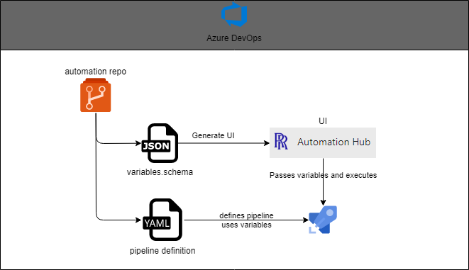

# Summary 

## Problem Statement

### Specific 

1. Wider uptake of ADO requires a level of standardisation, simplification and governance 
   - Examples: Creating repositories in a standard way, creating projects/teams, manageing security groups

### General

1. Running of ADO pipelines can be clunky when setting multiple, complex variables 
1. Common pipelines for general consumption across ADO is difficult (hard to find and execute for beginners)

## Architecture

--- 

# Development Docs 

## to run in dev server:

`npm run start:dev` 

- this will need the `dev` version of the extension to be published and installed in an ADO istance
- can use localhost, but the ADO API calls will not work

## to publish:

`npm run publish:dev -- --token <token>`, token needs to have marketplace publish perms in ADO for all organisations 

## TODO

- Extension default settings stored somewhere? and settable by admins only
- Use pipeline folders to define automation, add folder to settings 
- Wrap promise errors in ADO error prompt? 

# Design 

## React

Hub
|  | Dropdown |       |
|  |  |   HelpPanel   |   
|  | FormPage |       |   
|                     |
|                     |
| SubmitDialog        |
| ErrorDialog         |
| SettingsPanel       |

## Non-React

- ado-api
- utils 

# Useful links

- Icons: https://uifabricicons.azurewebsites.net/ 
